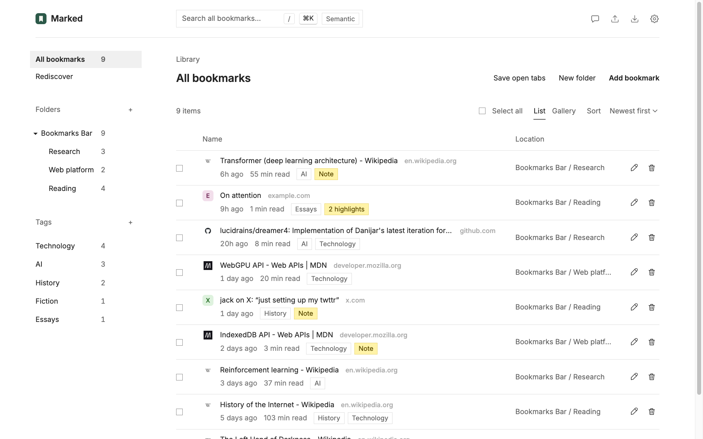
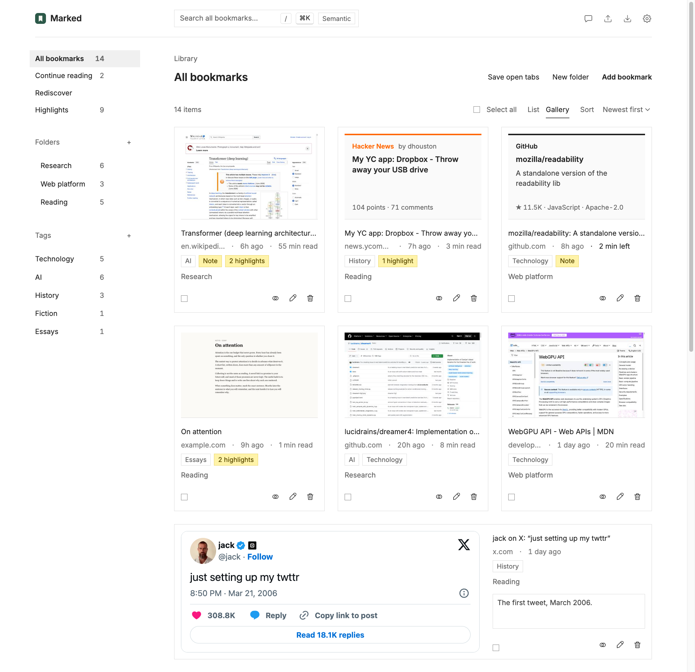
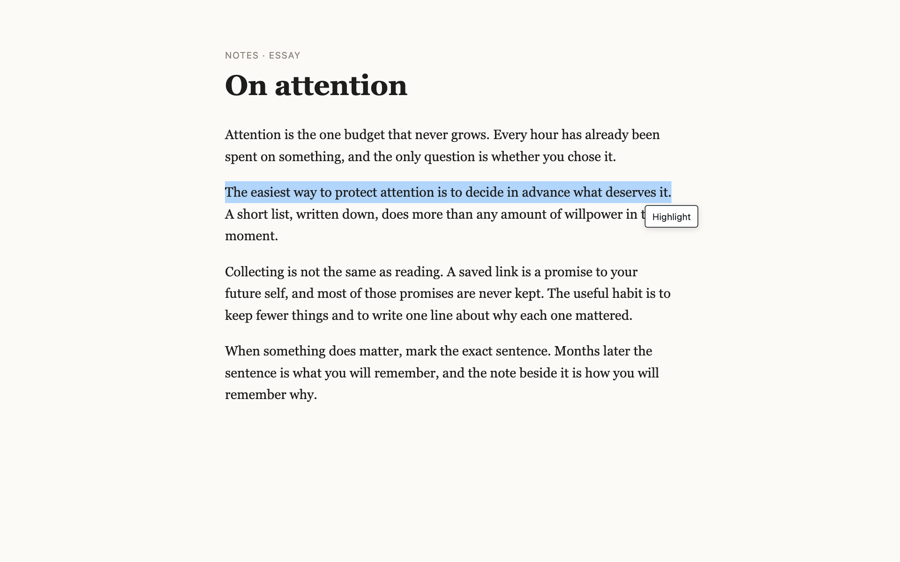
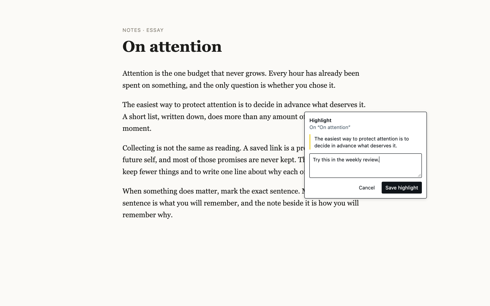
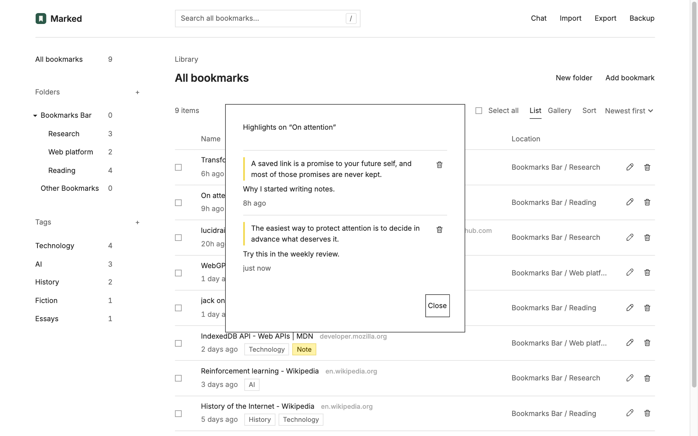
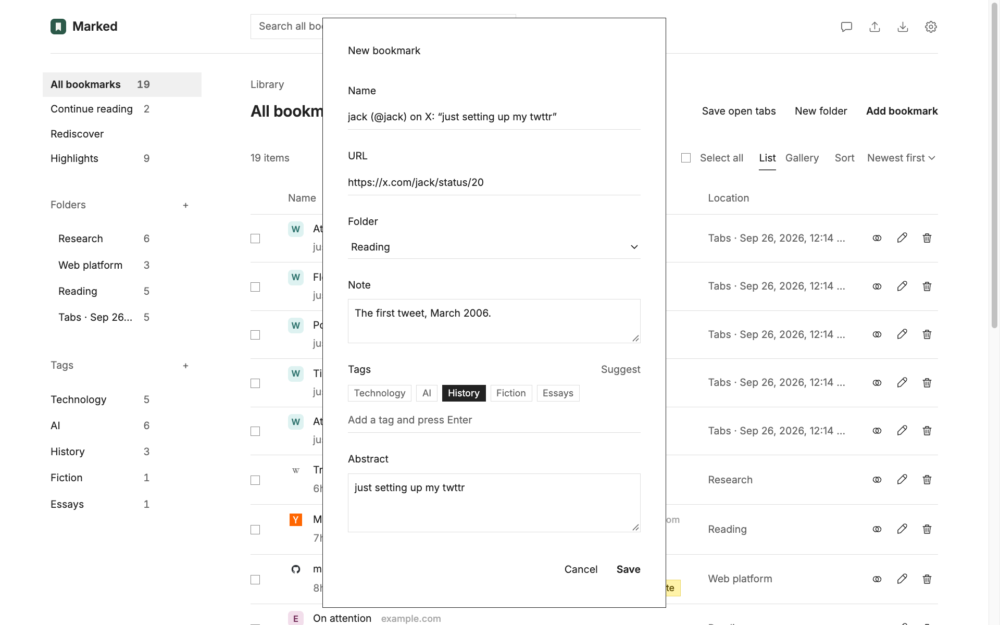
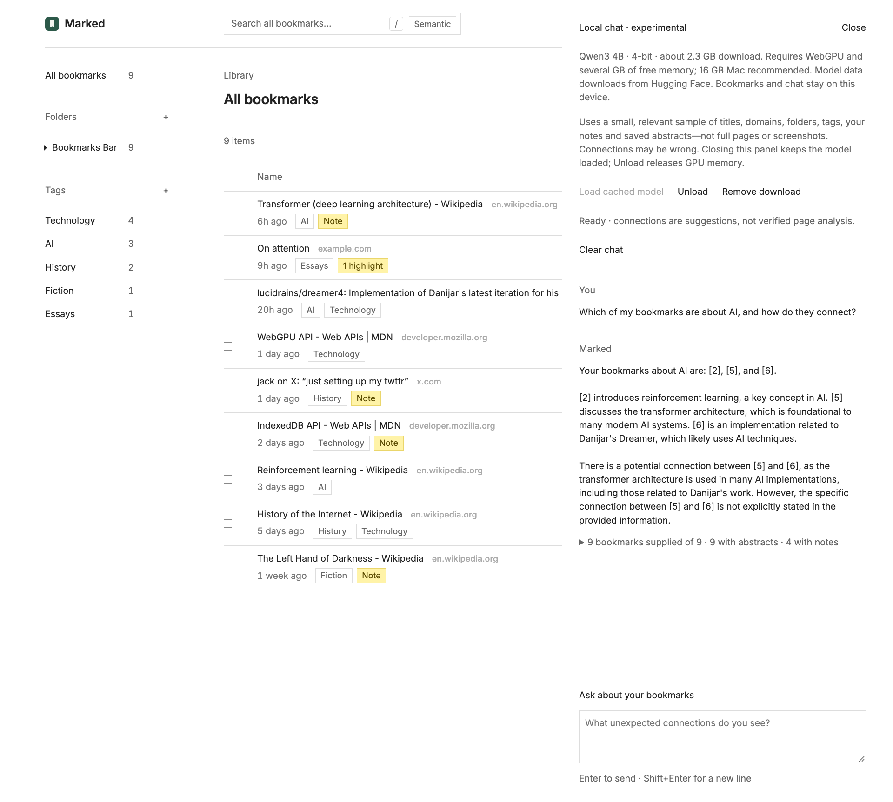

<p align="center">
  
</p>

<h1 align="center">Marked</h1>

<p align="center">
  <b>A quiet, local-first bookmark library for Chrome and Firefox.</b><br>
  Save pages, posts from X, and the exact sentences that mattered, add your own notes and tags,<br>
  and ask a private, on-device AI how it all connects.
</p>

<p align="center">
  
  
  
  
</p>

<p align="center">
  <a href="#install">Install</a> ·
  <a href="#features">Features</a> ·
  <a href="#how-to-use-it">How to use it</a> ·
  <a href="#local-chat">Local chat</a> ·
  <a href="#privacy-and-permissions">Privacy</a> ·
  <a href="#develop">Develop</a>
</p>

<p align="center">
  
</p>

---

Browser bookmarks are a pile of titles you never open again. Marked keeps the *why*: a note in your own words, the passage you highlighted, a short abstract of the page, and topic tags. Your library lives in your browser, not in someone's cloud, and the optional AI runs entirely on your GPU.

## Features

### A library that remembers why you saved things

- **Folders, tags, and notes.** Tag bookmarks with topics, jot a note on why you saved each one, and browse by folder or tag from the sidebar.
- **Abstracts, automatically.** When you save a page, Marked keeps its description and opening paragraphs, so search and chat know what the page is about.
- **Instant search** across titles, addresses, folders, tags, notes, abstracts, and highlights. Press <kbd>/</kbd> to jump to it.
- **Suggested tags** for new bookmarks, which you can accept, change, or ignore.

### A gallery with real previews

Every page you save through Marked can keep a small screenshot, so the gallery looks like the pages themselves. Posts from X show up as the official embedded post, with your tags and notes beside them.

<p align="center">
  
</p>

### Highlight any sentence, on any page

Select text on a web page and a **Highlight** button appears. On a page already in Marked, a small panel opens right there: add an optional note and save, without leaving the page. On a new page, Marked opens its editor with the passage ready, so the page and the highlight are saved together.

<table>
  <tr>
    <td width="50%"></td>
    <td width="50%"></td>
  </tr>
  <tr>
    <td align="center"><sub>Select text and choose <b>Highlight</b></sub></td>
    <td align="center"><sub>Add a note and save, right on the page</sub></td>
  </tr>
</table>

Every highlight is collected on its bookmark, with its note:

<p align="center">
  
</p>

### Save posts from X

Right-click a post on x.com and choose **Save tweet to Marked**. Marked saves the post under your pointer, not the page around it, with its text, author, and link. If the pointer isn't on a post, it tells you so instead of guessing.

<p align="center">
  
</p>

### Ask your bookmarks, privately

Open **Chat** and ask questions like *"What unexpected connections do you see?"* A 4-billion-parameter model (Qwen3 4B) runs on your GPU through WebGPU. It reads a relevant sample of your titles, tags, notes, abstracts, and highlights, answers with citations, and shows exactly which bookmarks it was given. Nothing is sent to a server.

<p align="center">
  
</p>

### Search by meaning with Jev

Turn on **Semantic** in the search box and describe what you're looking for, such as *"that essay about protecting focus"*. Marked asks TypeSafe's [Jev](https://typesafe.ai) model which bookmarks match, even when they share no words with your query, and puts them first, followed by ordinary keyword matches. It follows TypeSafe's [line-by-line search recipe](https://docs.typesafe.ai/cookbooks/semantic_find.md): each bookmark is one short line, a single request ranks up to 250 of them, and larger libraries are ranked in parallel windows and then merged. Bring your own API key: add it in **Settings**, and Marked checks it with a tiny request before saving it.

Every request's cost is added to a running total, shown after each search (*"This search $0.000076 · $0.0042 in total"*) and in **Settings**, where you can reset it. The estimate uses the token counts TypeSafe reports, at $0.042 per million input tokens; output is free. A typical search of a few hundred bookmarks costs well under a tenth of a cent, and repeating a search costs nothing until your library changes.

### Yours to keep

- **Independent from your browser's bookmarks.** Marked copies them once, on first run, and never changes them.
- **Backup and move between browsers.** A backup keeps everything: folders, dates, previews, abstracts, notes, tags, and highlights. Import it into Marked in another browser, for example from Firefox to Chrome.
- **Standard HTML export** for any other bookmark manager, with abstracts as descriptions and tags in Firefox's `TAGS` attribute.

## Install

Marked is not in the extension stores yet; load it from source. It needs desktop **Chrome 123+** or **Firefox 142+** and **Node.js 22+**. Both browsers load the same folder.

```sh
git clone https://github.com/shinoss/marked.git
cd marked
npm ci && npm run bundle:ai   # packages the local AI runtime (not the model weights)
```

Then load the extension:

- **Chrome:** open `chrome://extensions`, turn on **Developer mode**, choose **Load unpacked**, and select the repository folder.
- **Firefox:** open `about:debugging#/runtime/this-firefox`, choose **Load Temporary Add-on…**, and select `manifest.json`.

Open **Marked** from the browser's extensions menu. On first run it copies your existing bookmarks into its own library.

> [!NOTE]
> Chrome lists `'background.scripts' requires manifest version of 2 or lower` under **Errors**. This is expected: the manifest declares a service worker for Chrome and background scripts for Firefox, and each browser ignores the other's entry. Firefox removes temporary add-ons when it restarts; permanent installation requires Mozilla signing. Chrome keeps unpacked extensions across restarts.

## How to use it

| To… | Do this |
| --- | --- |
| Save the page you're on | Right-click it and choose **Add to Marked**. Review the name, folder, tags, note, abstract, and preview, then **Save**. |
| Save a post from X | Right-click the post and choose **Save tweet to Marked**. On x.com, Marked's items are grouped under **Marked — Bookmark Manager**. |
| Highlight a passage | Select text on any page and choose **Highlight**. Add a note if you like, then **Save highlight** (or <kbd>Ctrl</kbd>/<kbd>⌘</kbd>+<kbd>Enter</kbd>). |
| Read a note or highlights | Click the yellow **Note** or **N highlights** label on a bookmark. |
| Tag bookmarks | Use the tag chips in the editor, or **Suggest**. Add new tags with **+** next to **Tags** in the sidebar. |
| Find anything | Type in the search box, or press <kbd>/</kbd>. |
| Search by meaning | Add your TypeSafe API key in **Settings**, turn on **Semantic** in the search box, and describe what you want. |
| Ask a question | Open **Chat**. The first time, choose **Download / load model**. Press <kbd>Enter</kbd> to send, <kbd>Shift</kbd>+<kbd>Enter</kbd> for a new line. |
| Move to another browser | **Backup** in one browser, **Import** the `marked-backup-….json` file in the other. |

**A few details worth knowing**

- **Notes and highlights.** Gallery cards for pages show a **Note** label, so every page card stays the same height. Cards for posts from X show the note beside the post.
- **Tag suggestions.** Suggestions currently come from a small keyword matcher that runs on your device (`tagger.js`). It is a stand-in for TypeSafe's Jev model; Marked doesn't call any tagging service yet.
- **Older bookmarks.** Bookmarks copied from the browser, or imported without descriptions, have no abstract; add one with **Edit**.
- **Previews.** Uncheck **Save preview** in the editor if you don't want to keep a screenshot of a page.
- **A page without Marked's script.** If a tab was open before Marked was installed or reloaded, Marked adds its script when you use it. For posts from X, it then asks you to right-click the post again.

## Local chat

Chat runs **Qwen3 4B** (4-bit) with [WebLLM](https://github.com/mlc-ai/web-llm) on your GPU. No companion app, account, or API key is needed.

- **One-time download.** Choosing **Download / load model** asks for access to Hugging Face and downloads about **2.3 GB** once into the extension's own storage. After that, opening **Chat** loads the model from that copy, even after a restart, unless the browser's storage is cleared.
- **Hardware.** It needs WebGPU with `shader-f16` and at least 10 storage buffers per shader stage. On a Mac, use Chrome: some Firefox/macOS setups expose only 9 and can't run the runtime. Apple Silicon with 16 GB or more of memory is recommended. Marked checks your GPU before downloading anything. There is no CPU or cloud fallback, and a passing check doesn't guarantee the model will fit.
- **What the model sees.** A small, relevant sample of titles, domains, folders, tags, notes, abstracts (about 300 bytes each), and up to three highlights per bookmark, plus an overview of your tags. It never sees full pages or screenshots. The bookmarks it was given are listed under each answer.
- **Limits.** Connections are suggestions, and the model can be wrong. It can't browse or change your bookmarks. Chats are kept only until the page reloads.
- **Controls.** **Stop** interrupts an answer. **Unload** (after a confirmation) frees GPU memory but keeps the download. **Remove download** deletes the model files without touching your bookmarks. Only one Marked tab can hold the model at a time.

## Privacy and permissions

Your bookmarks, notes, tags, abstracts, highlights, and chats stay in your browser unless you turn on semantic search. Marked contacts only these outside services:

| Service | When | What it learns |
| --- | --- | --- |
| Google Fonts | Each time a Marked page opens (for the Inter font) | That Marked is in use. Without a connection, Marked uses Helvetica Neue. |
| Hugging Face | Only when you download the chat model | Your connection details |
| X (`platform.twitter.com`) | Only while the gallery shows a post from X | Which post is displayed. The list view never contacts X. |
| TypeSafe (`api.typesafe.ai`) | Only for searches with **Semantic** on, using your API key | Your query and one line per bookmark: title, domain, folder, tags, abstract, and, if you allow them in **Settings**, notes and highlights. Full addresses are never sent. TypeSafe says it doesn't train on customer data. |

| Permission | Why Marked needs it |
| --- | --- |
| `bookmarks` | Copy your browser's bookmarks once, on first run |
| `storage`, `unlimitedStorage` | Keep the library, previews, and the chat model on your device |
| `contextMenus` | **Add to Marked** and **Save tweet to Marked** |
| `activeTab`, `scripting` | Read the abstract of the page you're saving, when you save it |
| Access to all websites | Show the **Highlight** button when you select text, and capture a preview and abstract when you highlight a page that isn't saved yet. The script does nothing until you click the button, and sends nothing off your device. |
| x.com and twitter.com | Find the post under your pointer for **Save tweet to Marked** |
| Hugging Face (optional) | Download the chat model; requested when you first load it |
| TypeSafe (optional) | Semantic search; requested when you save an API key |

Browsers describe site access as *"read and change all your data on all websites."* Firefox may leave that access ungranted after an update; Marked then shows an **Allow** banner, and on x.com it asks the first time you save a post.

## Develop

```sh
npm ci
npm run bundle:ai        # once, before loading from source
npm test                 # unit and DOM tests (mocked browser APIs)
npm run lint:extension   # Firefox compatibility (one expected warning)
npm run build            # extension ZIP in web-ext-artifacts/
```

Reload the Marked tab after UI changes. After changing the manifest or background script, reload the extension in `chrome://extensions` or `about:debugging`. Builds load in Chrome after unzipping. Automated tests don't run the multi-GB model, so test GPU inference and the model cache in a real browser on the target machine.

| Path | What it does |
| --- | --- |
| `manager.html`, `manager.js`, `styles.css` | The library interface |
| `store.js` | Local library, tag list, and the first-run bookmark copy |
| `background.js` | Menus, the toolbar button, and saving (a Chrome service worker and a Firefox event page) |
| `page-abstract.js` | Reads a page's description and opening text |
| `highlighter.js` | Content script for the Highlight button and panel |
| `tweet-capture.js` | Content script that finds the post under the pointer on x.com |
| `tagger.js` | Tag suggestions (a local stand-in for a future Jev integration) |
| `jev.js`, `semantic-search.js` | The Jev client, cost tracking, and semantic search |
| `bookmarks.js`, `backup.js` | Import, export, and backups |
| `chat.js`, `ai-context.js`, `ai-config.js` | Local chat and what the model sees |
| `ai/`, `scripts/bundle-ai.js` | The bundled WebLLM worker and runtime |
| `browser-api.js` | Provides the `browser` namespace in Chrome |
| `tests/` | Automated tests |

Executable JavaScript and WASM are packaged with the extension; only model data is downloaded at runtime. The build pins the model revision and verifies the packaged model WASM checksum. `vendor/` is generated and excluded from Git but included in the extension ZIP, together with the license files of the bundled libraries (WebLLM and loglevel).

<p align="center"><sub>Screenshots show a demo library. The essay page is a demo served at <code>example.com</code>; page previews show Wikipedia, MDN, and GitHub.</sub></p>
