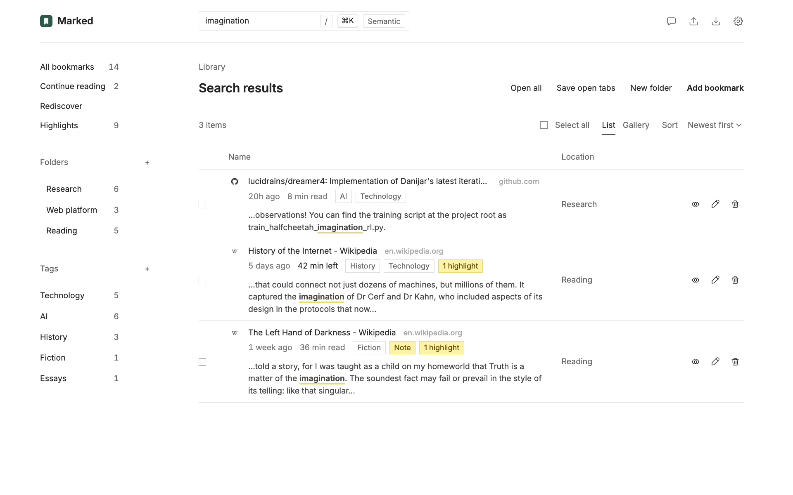
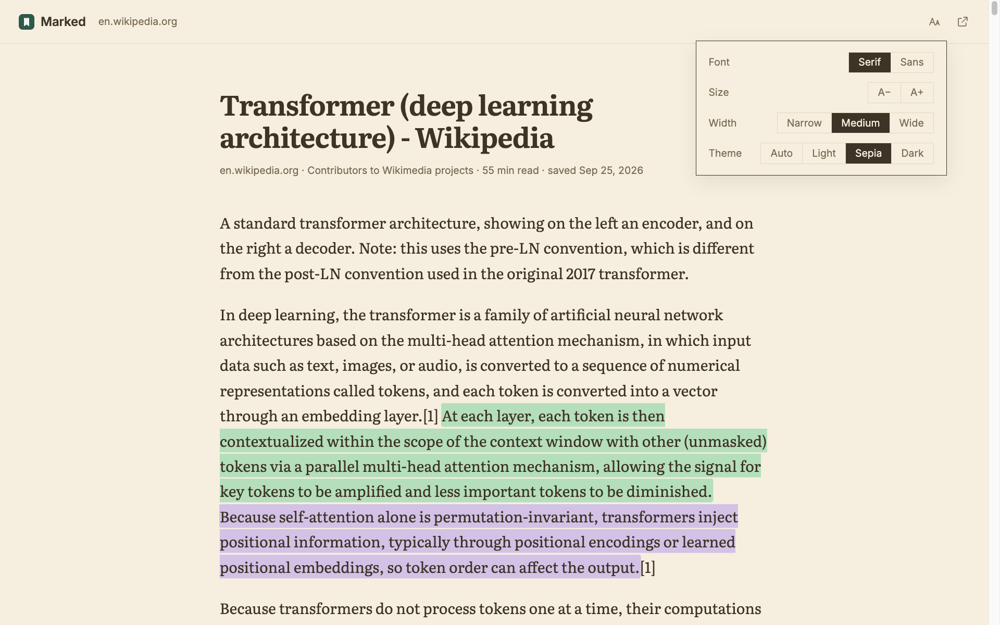
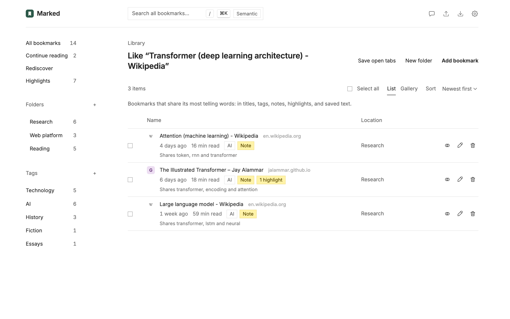
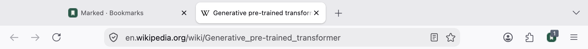
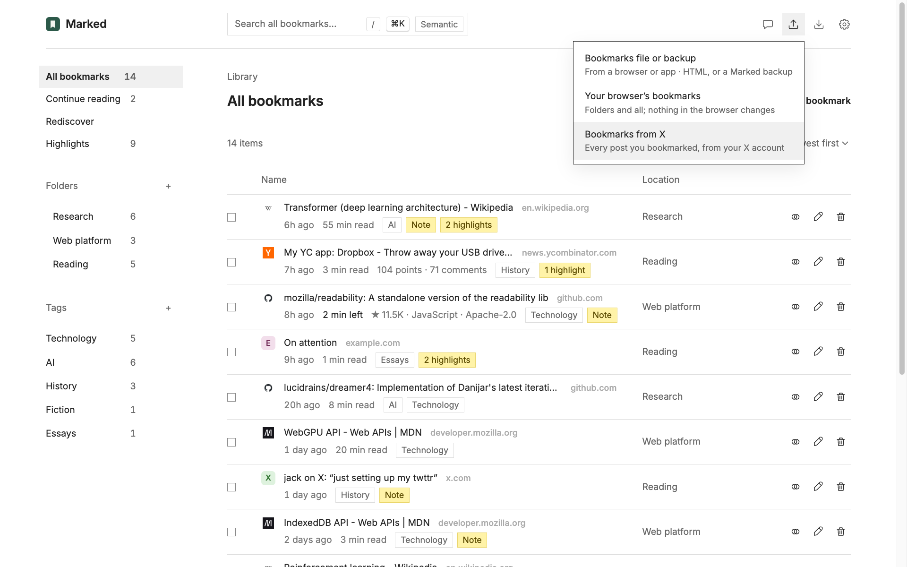

<p align="center">
  
</p>

<h1 align="center">Marked</h1>

<p align="center">
  <b>A local-first bookmark library for Chrome and Firefox.</b><br>
  Save pages, posts from X, and the sentences that mattered, with your own notes and tags,<br>
  read them in a clean reader, and ask a private, on-device AI how it all connects.
</p>

<p align="center">
  
  
  
  
</p>

<p align="center">
  <a href="#features">Features</a> ·
  <a href="#install">Install</a> ·
  <a href="#privacy">Privacy</a> ·
  <a href="#develop">Develop</a>
</p>

<p align="center">
  
</p>

---

Browser bookmarks are a pile of titles you never open again. Marked keeps the *why*: your note, the passage you highlighted, a short abstract of the page, and tags. It all stays in your browser.

## Features

### Organize and find

Folders, tags, notes, and page abstracts captured when you save. Search everything instantly (press <kbd>/</kbd>), or browse a gallery of page previews and embedded posts from X. Hacker News stories and comments, and GitHub repositories, issues, and pull requests, get a card instead of a preview: points and comments; stars, language, and license; or whether it's open, closed, or merged. Each bookmark shows its site's icon, or its initial in the site's color.

Drag bookmarks and folders onto a folder in the sidebar, the list, or the path above it; select several to move them together, and undo a move from the message that follows. In a folder sorted by **Saved order**, drag between rows, or press <kbd>Alt</kbd>+<kbd>↑</kbd> and <kbd>Alt</kbd>+<kbd>↓</kbd>, to arrange it by hand.

<p align="center">
  
</p>

### Search and read every page

Marked keeps the readable text of each page you save, so search finds any word in it and shows you the passage. For Hacker News and GitHub, it keeps the discussion or the README.

<p align="center">
  
</p>

Choose the reading time on a bookmark, or a passage in the results, to open the saved copy in Marked's reader, even after the page is gone. Pick the font, size, width, and a light, sepia, or dark page. A bar shows how far along you are, and the reader remembers where you stopped. Select text to highlight it in a color or add a note, or press <kbd>H</kbd>. Hacker News and GitHub bookmarks open with their card on top, and related bookmarks follow the text. If a bookmark's text isn't saved yet, the reader offers to download it; **Settings → Page text** downloads it for every bookmark saved earlier.

<p align="center">
  
</p>

### Find what's related

Choose **More like…** (the two rings) on any bookmark to see the bookmarks that share its most telling words, and which words they share. Marked works this out on your device, from titles, tags, notes, highlights, abstracts, cards, and saved text.

<p align="center">
  
</p>

On a page you haven't saved, the Marked button shows how many of your bookmarks relate to it; choose the button to see them. Turn the count off in **Settings → Browsing**.

<p align="center">
  
</p>

### Jump anywhere

Press <kbd>⌘</kbd>+<kbd>K</kbd> (<kbd>Ctrl</kbd>+<kbd>K</kbd> on Windows and Linux) to jump to any bookmark, folder, or tag, or to run a command. Press <kbd>?</kbd> for every shortcut.

<p align="center">
  
</p>

### Keep it fresh

- **Continue reading** lists the pages you started in the reader and haven't finished, latest first. Open one to pick up where you left off.
- **Rediscover** brings back a few things you saved a while ago, favoring ones with notes or highlights.
- **Duplicates** finds pages you saved more than once and merges them, keeping every tag, note, and highlight.

### Highlight any sentence

Select text on any page and choose **Highlight**, or press <kbd>Alt</kbd>+<kbd>Shift</kbd>+<kbd>H</kbd>, to save the passage in yellow, green, blue, pink, or purple, with a note if you like. Open the page again and your highlights are marked in their colors; hover over one to see your note.

<table>
  <tr>
    <td width="50%"></td>
    <td width="50%"></td>
  </tr>
</table>

<p align="center">
  
</p>

**Highlights** in the sidebar lists every highlight in your library, newest first. Narrow it by color, site, or date, or search it. Hover over one to change its color, open its passage, or delete it, with Undo.

<p align="center">
  
</p>

### Save posts from X

Right-click a post on x.com and choose **Save tweet to Marked**. On a post's own page, Marked also keeps the author's thread as the bookmark's text.

<p align="center">
  
</p>

To bring in everything you've bookmarked on X, choose **Import → Bookmarks from X** while you're signed in to X. Marked opens your bookmarks on x.com, scrolls through them, and saves each post to an **X bookmarks** folder, newest first. A panel on the page shows the progress and can stop it. Import again later and Marked adds only the new posts.

<p align="center">
  
</p>

### From any tab

- Type `mk` and a space in the address bar to search your library.
- The Marked button shows ✓ on pages you've saved, and on other pages how many of your bookmarks relate to them.
- <kbd>Alt</kbd>+<kbd>Shift</kbd>+<kbd>M</kbd> saves the page you're on.
- **Save open tabs** keeps the whole window as a folder; **Open all** brings it back.

<p align="center">
  
</p>

<p align="center">
  
</p>

<table>
  <tr>
    <td width="50%"></td>
    <td width="50%"></td>
  </tr>
</table>

### Ask your bookmarks

**Chat** runs Qwen3 4B on your GPU and answers with citations to your bookmarks. Nothing leaves your device.

<p align="center">
  
</p>

### Light or dark

Marked follows your system's theme, or pick one in **Settings**.

<p align="center">
  
</p>

### Search by meaning

Add a [TypeSafe Jev](https://typesafe.ai) API key in **Settings**, then click **Semantic** to rank bookmarks by meaning instead of keywords.

### Yours to keep

On first run, Marked offers to import your browser's bookmarks, folders and all, and never changes them. **Export** makes a backup of everything, saved page text included, to restore with **Import** in any browser's Marked. It can also write a standard bookmarks file, or your notes and highlights as Markdown.

<p align="center">
  
</p>

## Install

Load it from source. You need desktop Chrome 123+ or Firefox 142+, and Node.js 22+.

```sh
git clone https://github.com/shinoss/marked.git
cd marked
npm ci && npm run bundle
```

- **Chrome:** open `chrome://extensions`, turn on **Developer mode**, choose **Load unpacked**, and select the folder.
- **Firefox:** open `about:debugging#/runtime/this-firefox`, choose **Load Temporary Add-on…**, and select `manifest.json`.

> [!NOTE]
> Chrome shows a harmless `'background.scripts' requires manifest version of 2 or lower` error, because one manifest serves both browsers. Firefox removes temporary add-ons when it restarts.

Local chat needs WebGPU and downloads the model (about 2.3 GB) from Hugging Face once. On a Mac, use Chrome and 16 GB of memory or more.

## Privacy

Your library stays in your browser. Marked only contacts:

- **Google Fonts**, for the Inter and Literata fonts.
- **Hugging Face**, when you download the chat model.
- **X**, to show embedded posts in the gallery, and to read your bookmarks page on x.com when you import your X bookmarks.
- **Hacker News and GitHub**, through their public APIs, for a card and the discussion or README when you save one of their pages, open it again, or download text. No cookies go with these requests.
- **TypeSafe**, when you click **Semantic**: your query and each bookmark's title and abstract (plus notes and highlights, if you allow them). Never addresses, folders, or tags.
- **The sites you bookmarked**, when you download text in Settings or the reader, to read pages saved before Marked kept their text. No cookies go with these requests.

Access to all websites lets Marked show the **Highlight** button, mark saved highlights, show ✓ on saved pages, count related bookmarks on others (from the page's title, description, headings, and opening paragraphs), keep the text of pages you save or open again, and read your open tabs for **Save open tabs**. None of that leaves your device.

## Develop

```sh
npm ci
npm run bundle           # once
npm test                 # unit and DOM tests
npm run lint:extension   # Firefox compatibility
npm run build            # extension ZIP in web-ext-artifacts/
```

After changing the manifest or background script, reload the extension. The tests mock the browser and don't run the model.
