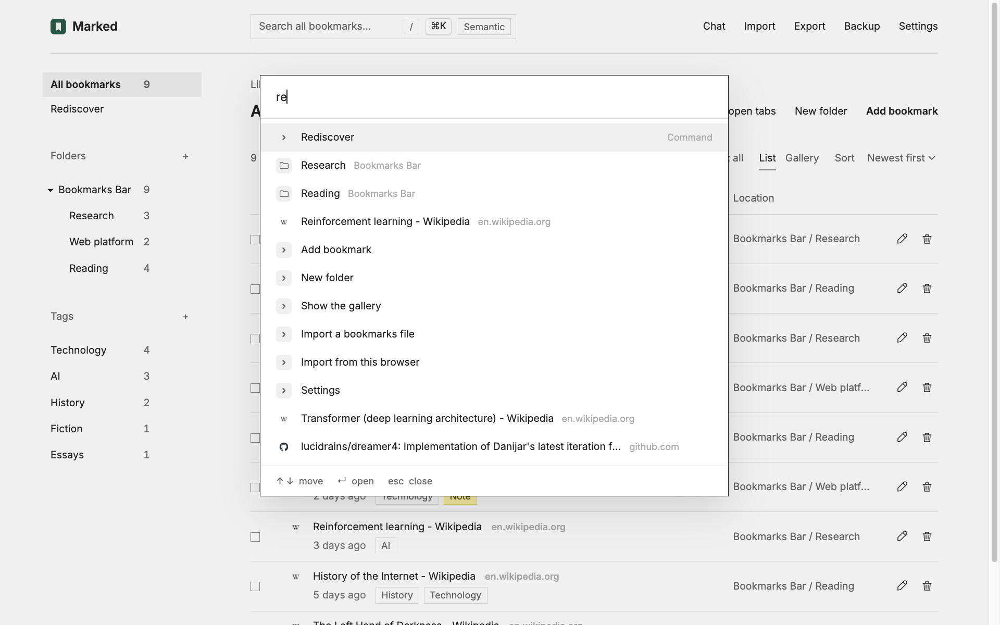
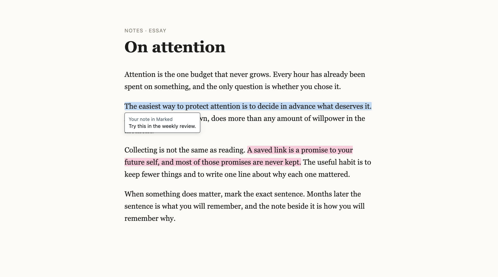
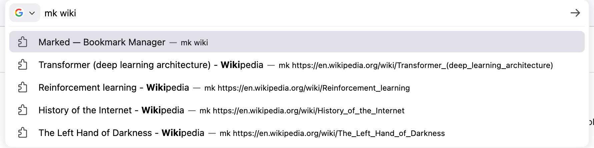
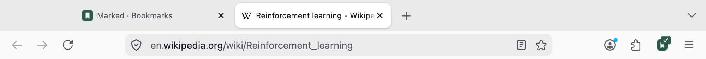
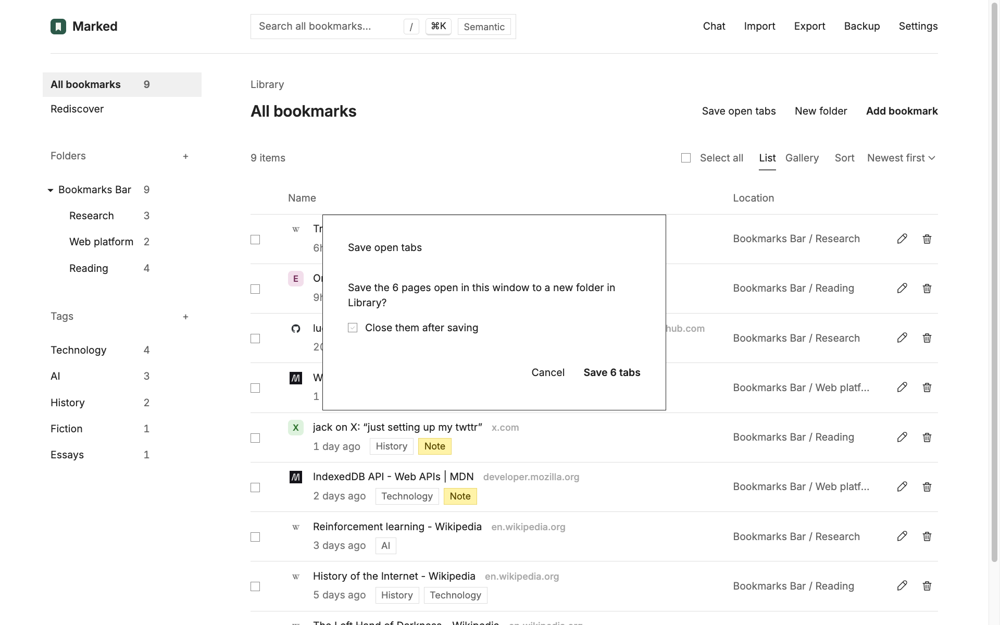
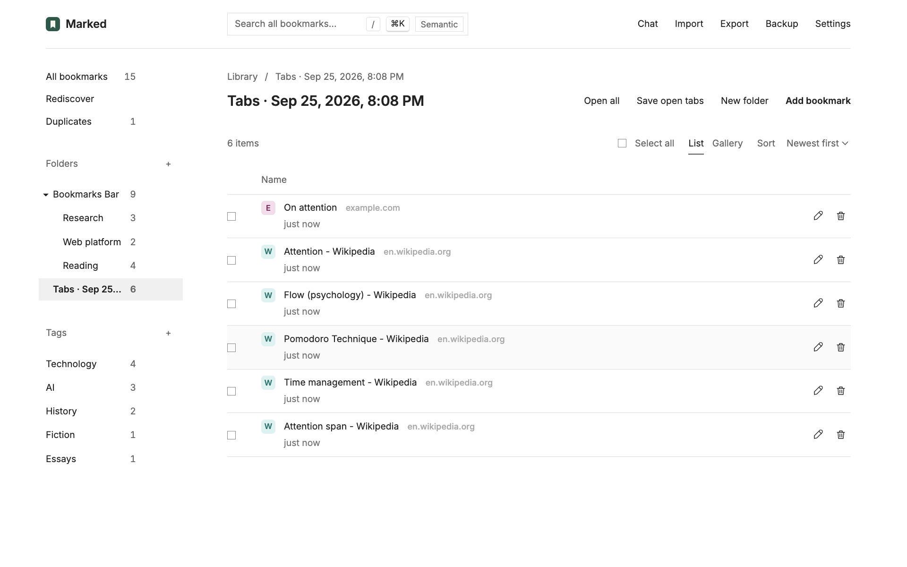
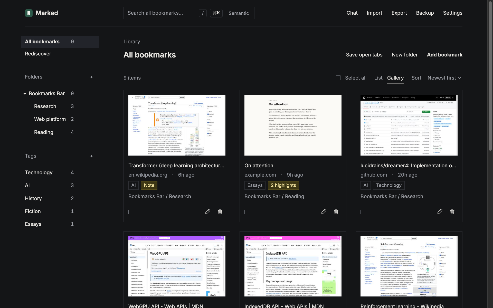
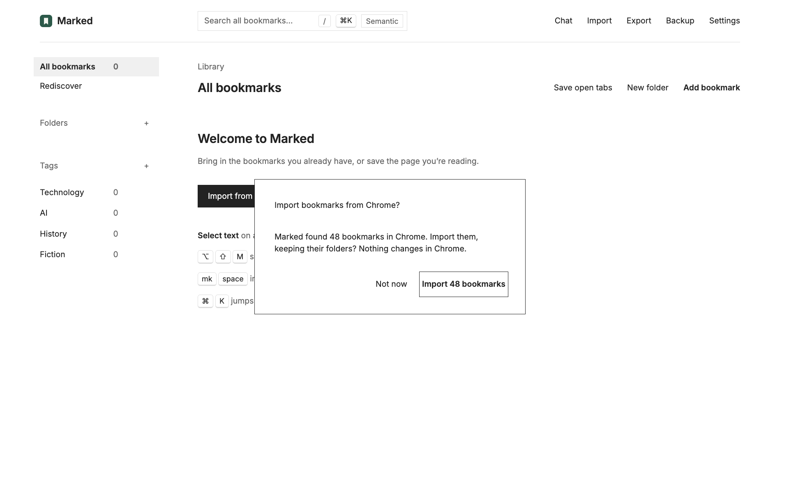

<p align="center">
  
</p>

<h1 align="center">Marked</h1>

<p align="center">
  <b>A local-first bookmark library for Chrome and Firefox.</b><br>
  Save pages, posts from X, and the sentences that mattered, with your own notes and tags,<br>
  and ask a private, on-device AI how it all connects.
</p>

<p align="center">
  
  
  
  
</p>

<p align="center">
  <a href="#features">Features</a> ·
  <a href="#install">Install</a> ·
  <a href="#privacy">Privacy</a> ·
  <a href="#develop">Develop</a>
</p>

<p align="center">
  
</p>

---

Browser bookmarks are a pile of titles you never open again. Marked keeps the *why*: your note, the passage you highlighted, a short abstract of the page, and tags. It all stays in your browser.

## Features

### Organize and find

Folders, tags, notes, and page abstracts captured when you save. Search everything instantly (press <kbd>/</kbd>), or browse a gallery of page previews and embedded posts from X. Each bookmark shows its site's icon, or its initial in the site's color.

<p align="center">
  
</p>

### Jump anywhere

Press <kbd>⌘</kbd>+<kbd>K</kbd> (<kbd>Ctrl</kbd>+<kbd>K</kbd> on Windows and Linux) to jump to any bookmark, folder, or tag, or to run a command. Press <kbd>?</kbd> for every shortcut.

<p align="center">
  
</p>

### Keep it fresh

- **Rediscover** brings back a few things you saved a while ago, favoring ones with notes or highlights.
- **Duplicates** finds pages you saved more than once and merges them, keeping every tag, note, and highlight.

### Highlight any sentence

Select text on any page and choose **Highlight** to save the passage with a note. Open the page again and your highlights are marked in yellow; hover over one to see your note.

<table>
  <tr>
    <td width="50%"></td>
    <td width="50%"></td>
  </tr>
</table>

<p align="center">
  
</p>

### Save posts from X

Right-click a post on x.com and choose **Save tweet to Marked**.

<p align="center">
  
</p>

### From any tab

- Type `mk` and a space in the address bar to search your library.
- The Marked button shows ✓ on pages you've saved.
- <kbd>Alt</kbd>+<kbd>Shift</kbd>+<kbd>M</kbd> saves the page you're on.
- **Save open tabs** keeps the whole window as a folder; **Open all** brings it back.

<p align="center">
  
</p>

<p align="center">
  
</p>

<table>
  <tr>
    <td width="50%"></td>
    <td width="50%"></td>
  </tr>
</table>

### Ask your bookmarks

**Chat** runs Qwen3 4B on your GPU and answers with citations to your bookmarks. Nothing leaves your device.

<p align="center">
  
</p>

### Light or dark

Marked follows your system's theme, or pick one in **Settings**.

<p align="center">
  
</p>

### Search by meaning

Add a [TypeSafe Jev](https://typesafe.ai) API key in **Settings**, then click **Semantic** to rank bookmarks by meaning instead of keywords.

### Yours to keep

On first run, Marked offers to import your browser's bookmarks, folders and all, and never changes them. **Backup** moves everything to Marked in another browser; **Export** writes a standard bookmarks file, or your notes and highlights as Markdown.

<p align="center">
  
</p>

## Install

Load it from source. You need desktop Chrome 123+ or Firefox 142+, and Node.js 22+.

```sh
git clone https://github.com/shinoss/marked.git
cd marked
npm ci && npm run bundle:ai
```

- **Chrome:** open `chrome://extensions`, turn on **Developer mode**, choose **Load unpacked**, and select the folder.
- **Firefox:** open `about:debugging#/runtime/this-firefox`, choose **Load Temporary Add-on…**, and select `manifest.json`.

> [!NOTE]
> Chrome shows a harmless `'background.scripts' requires manifest version of 2 or lower` error, because one manifest serves both browsers. Firefox removes temporary add-ons when it restarts.

Local chat needs WebGPU and downloads the model (about 2.3 GB) from Hugging Face once. On a Mac, use Chrome and 16 GB of memory or more.

## Privacy

Your library stays in your browser. Marked only contacts:

- **Google Fonts**, for the Inter font.
- **Hugging Face**, when you download the chat model.
- **X**, to show embedded posts in the gallery.
- **TypeSafe**, when you click **Semantic**: your query and each bookmark's title and abstract (plus notes and highlights, if you allow them). Never addresses, folders, or tags.

Access to all websites lets Marked show the **Highlight** button, mark saved highlights, show ✓ on saved pages, and read your open tabs for **Save open tabs**. None of that leaves your device.

## Develop

```sh
npm ci
npm run bundle:ai        # once
npm test                 # unit and DOM tests
npm run lint:extension   # Firefox compatibility
npm run build            # extension ZIP in web-ext-artifacts/
```

After changing the manifest or background script, reload the extension. The tests mock the browser and don't run the model.

<p align="center"><sub>Screenshots show a demo library; the essay is a demo page served at <code>example.com</code>.</sub></p>
